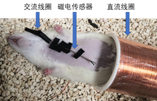
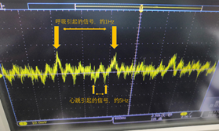
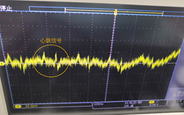
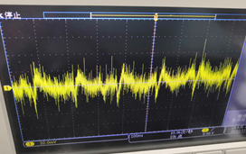

<!-- more -->

# 工作周报

## 2019/9/16

- 调研小鼠心脏信号测定实验方案

- 联系学长

## 2019/9/17

- 与储学长和徐学长沟通，制定实验计划

## 2019/9/18

- 联系储学长，借线圈和磁电传感器
- 联系泰克，借用示波器和信号发生器

## 2019/9/19

- 上午搬运实验
- 下午晚上实验

#### 实验内容：

- 首先把小鼠麻醉、胸部毛发剔除干净。
- 将交流线圈套在磁电传感器上，将磁电传感器紧贴小鼠心脏皮肤表面，再将小鼠放入直流线圈中

- 接通交流激励

**一些分析：**所谓呼吸引起的信号，应该是机械运动导致传感器相对磁场发生移动而产生的电信号，心跳引起的信号，可能包含有机械振动引起的信号、心脏电流产生的磁场变化引起的信号、心脏表面皮肤电流引起的电信号

- 用绝缘带把传感器电极保住使之不与小鼠皮肤接触，比去掉交流激励和直流偏置

**一些分析：**不再能看到呼吸引起的信号了，因为去除了交流激励和直流偏置，呼吸引起的机械振动不再产生信号；由于将电极绝缘了，因此排除了皮肤表面电信号的干扰，测到这个频率约为6Hz的信号，很有可能就是我们想要的心脏磁场信号。

## 2019/9/20

分析实验结果，计划下一步研究计划

# 下周计划

- 再安排1~2次实验