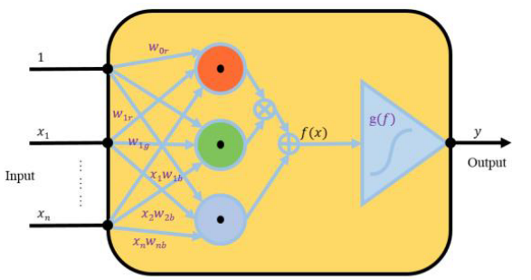
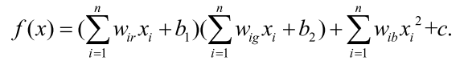
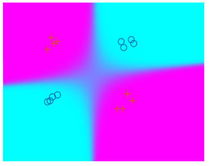
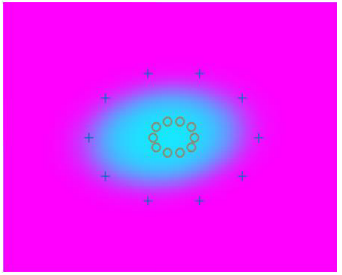
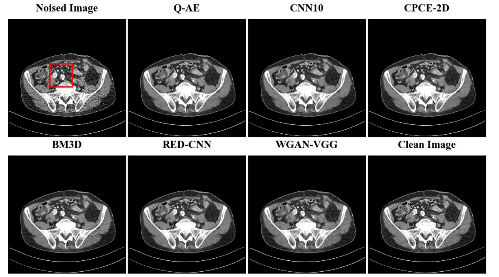
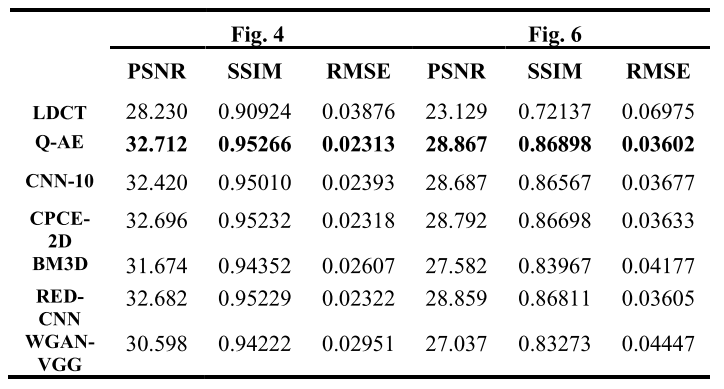
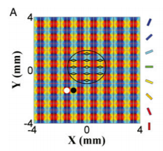

<!-- more -->

# 工作周报

## 2019/10/14

- 回交大
- 社会科学中的大数据分析
- 复分析

## 2019/10/15

- 与周栋焯教授面谈
- 人工智能前沿应用论坛——xyz科技，周佳骥
- 微分几何

## 2019/10/16

- 看论文
- 学习pytorch
- 写作业

## 2019/10/17

- 写作业

- NCS 实验室组会

## 2019/10/18

- 学习计算神经科学

- 偏微分方程

## 2019/10/19

- 看计算神经科学方向的论文

## 计算神经科学选题

### 二次神经网络（Quadratic Deep Networks）

#### output function：

使用二次神经元（Quadratic Neuron）代替传统的点乘神经元有助于在线性不可分的问题上达到更好的效果

#### 在CT去噪实验中的表现

**二次网络存在三个定理，表明二次网络在表达性和效率方面有很大的潜力。未来的研究将集中于评价二次深度神经网络在典型应用中的性能。**

### 大型皮层网络动力学建模与仿真

系统神经科学的一个基本问题是，大脑如何在早期感觉皮层对外界刺激进行编码

real-time optical imaging based on VSD  +  Model cortical network

电压敏感染料(VSD)技术测量V1在高时空分辨率下的响应，然后使用与实验相同的数据处理过程，在高时空分辨率下的响应，将mcn的时空动态与实验观察结果进行对比V1，以此来研究V1实验中可能的解码和编码策略

# 下周计划

- 学习计算神经学基础知识
- 学习pytorch