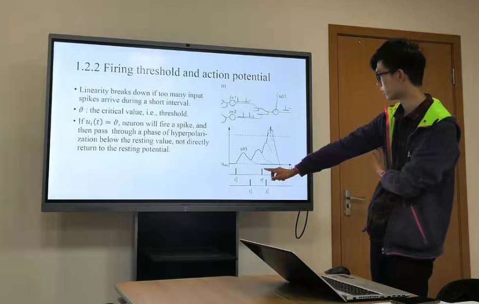
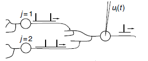
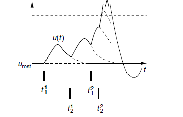
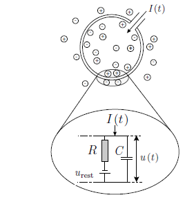
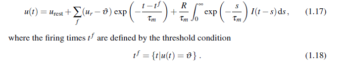
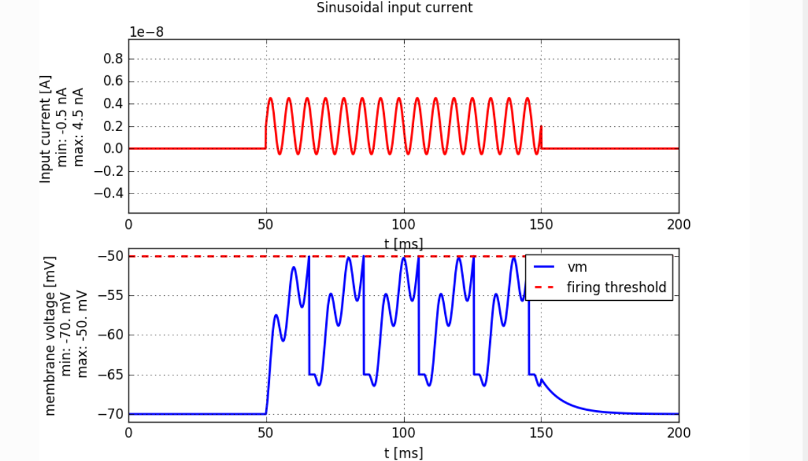
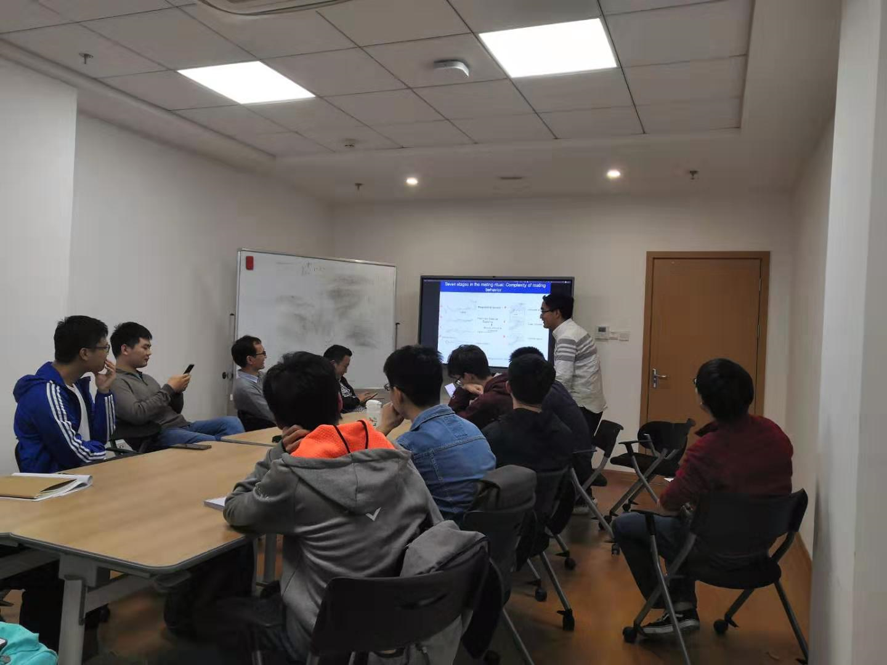

<!-- more -->

# 工作周报

## 2019/10/21

- 上课《**社会科学中的大数据分析**》
- 上课《**复分析**》
- 参加计算神经学教学班
  - 
  - 
  - 

## 2019/10/22

- 上课《**媒体智能**》
- 上课《**人工智能与网络安全**》
- 上课《**微分几何**》
- YouTube网课，学习《**Neuronal Dynamics**》
  - **A first simple neuron model**

## 2019/10/23

- 尝试使用python库 [Brian2 Simulator](https://github.com/brian-team/brian2) 对神经元进行仿真
  - 

## 2019/10/24

- CNS组会：《decoding the behavior of male C. elegans by its neural activity 》
  - 
  - 学习比较LSTM与RNN

## 2019/10/25

- 写作业

- 上课《**偏微分方程**》

# 下周计划

- 完成《Quadratic Deep Networks》，制作ppt并准备pre
- 继续学习《**Neuronal Dynamics**》课程
- 继续进行 [Brian2 Simulator](https://github.com/brian-team/brian2)编程练习
- 参观猴子实验室，参观灵长类动物活体实验