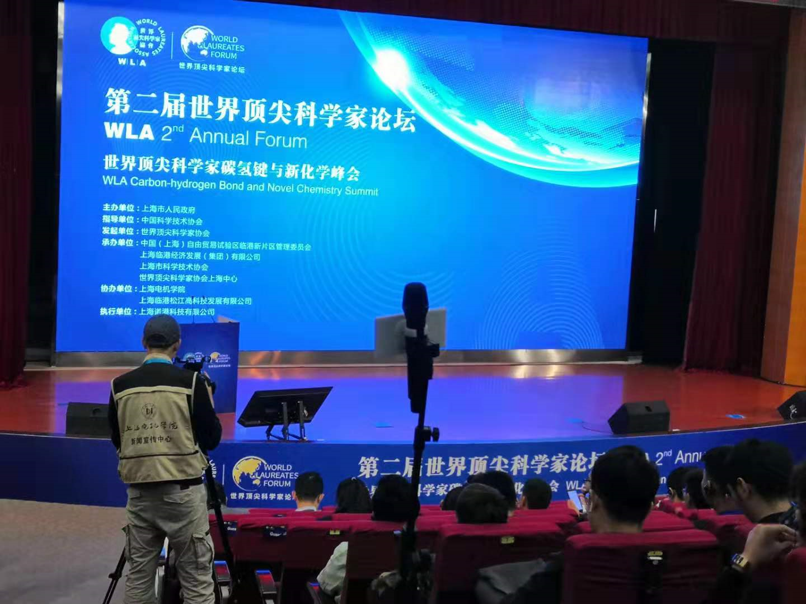
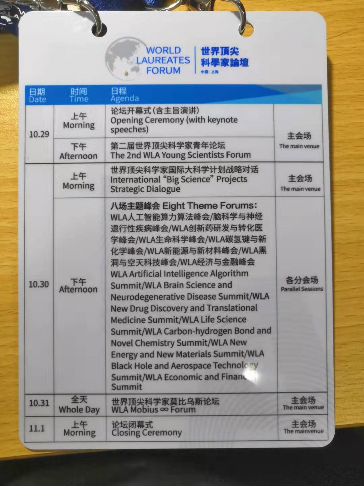
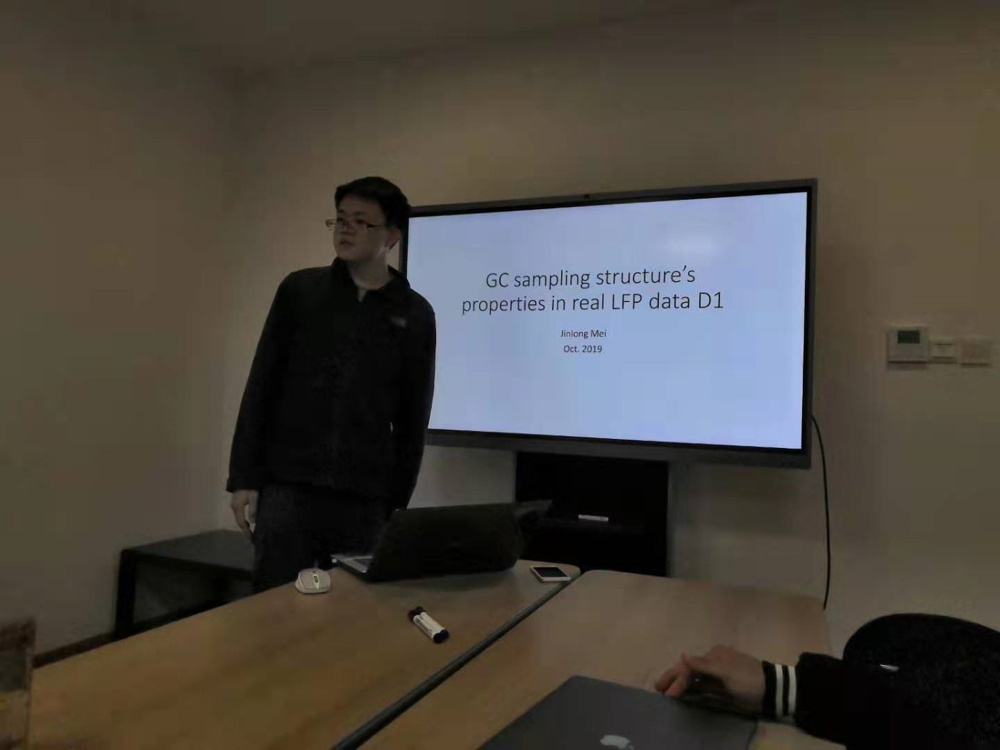
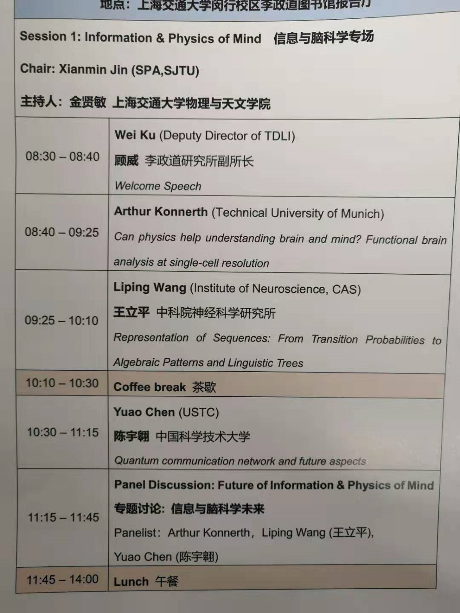
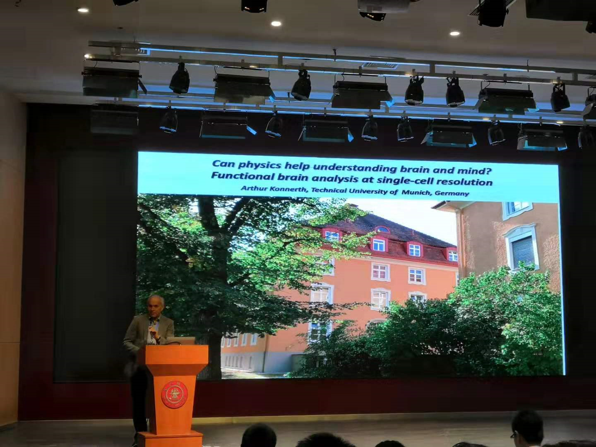

<!-- more -->

# 工作周报

## 2019/10/28

- 复习，准备考试

- 上课《**社会科学中的大数据分析**》
- 《**复分析**》期中考试

## 2019/10/29

- 上课《**媒体智能**》
- 上课《**人工智能与网络安全**》
- 上课《**微分几何**》

## 2019/10/30

- 参加《**第二届世界顶尖科学家论坛**》
	- 
- CNS组会：GC sampling structure's properties in real LFP data D1
  - 

## 2019/10/31

- 参加《**物理新兴前沿国际学术研讨会——信息与脑科学专场**》
  - 
- 看quadratic network论文，制作ppt

## 2019/11/1

- 看quadratic network论文，制作ppt
- 上课《**偏微分方程**》

# 下周计划

- 继续学习《**Neuronal Dynamics**》课程
- 继续进行 [Brian2 Simulator](https://github.com/brian-team/brian2)编程练习
- 组会pre
- 去微纳能源所与学长讨论PMUT