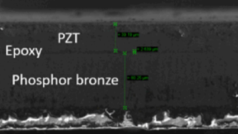

<!-- more -->

# 工作周报

## 2019/11/4

- 上课《**社会科学中的大数据分析**》
- 上课《**复分析**》

## 2019/11/5

- 上课《**媒体智能**》
- 上课《**人工智能与网络安全**》
- 上课《**微分几何**》

## 2019/11/6

- 写作业

- 参加CNS组会——《 Stochastic process in the neuronal networks》

## 2019/11/7

- 联系交大微所学长，了解PZT加工工艺
  - 

- 尝试用matlab复现论文《**Universal Approximation with Quadratic Deep Networks**》对函数的拟合

## 2019/11/8

- 写大作业
- 调研[Ujwal Radhakrishna](http://ujwal.mit.edu/)

- 上课《**偏微分方程**》

# 下周计划

- 复现论文
- 研究二次神经元中三个定理的证明
- 参观学习交大微所PMUT制作工艺