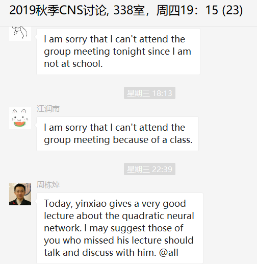
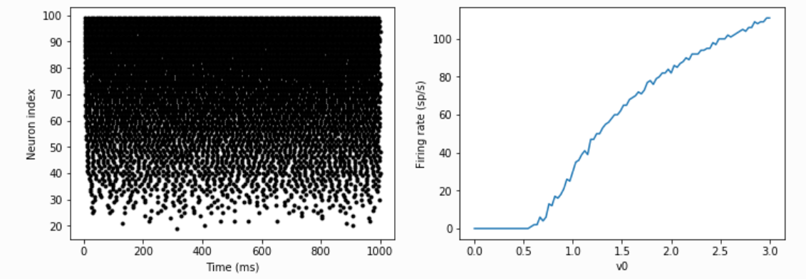
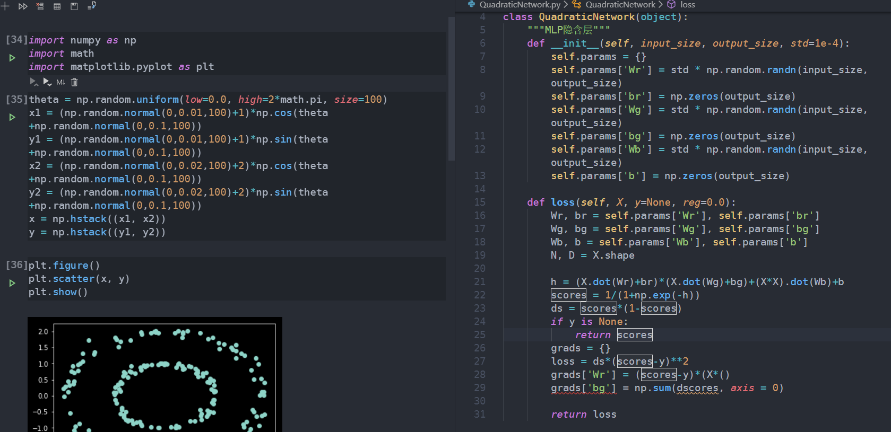

<!-- more -->

# 工作周报

## 2019/11/11

- 上课《**社会科学中的大数据分析**》
- 上课《**复分析**》
- 研究二次神经元中三个定理的证明

## 2019/11/12

- 上课《**媒体智能**》
- 上课《**人工智能与网络安全**》
- 上课《**微分几何**》

## 2019/11/13

- 写作业
- 组会报告
  - 

## 2019/11/14

- 学习python brain2库，并仿真HH模型
  - 
- 用python实现quadratic network
  - 

## 2019/11/15

- 写毕业设计任务书
- 写作业
- 上课《**偏微分方程**》

# 下周计划

- 继续学习brain2和quadratic network实现

- 准备讲座

  - 

- 写毕业设计开题报告

  

