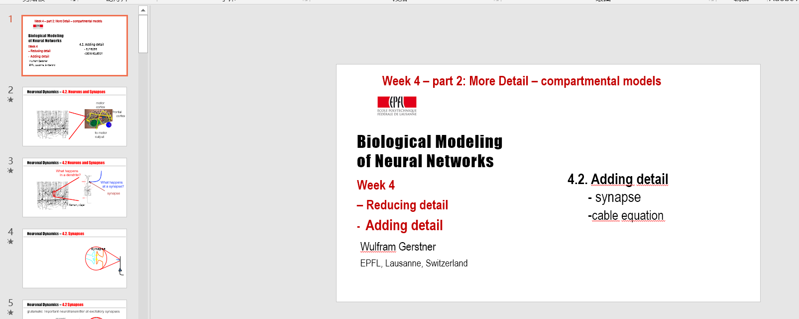

<!-- more -->

# 工作周报

## 2019/11/18

- 上课《**社会科学中的大数据分析**》
- 上课《**复分析**》
- Dendrites and Synapses讲课
  - 

## 2019/11/19

- 上课《**媒体智能**》
- 上课《**人工智能与网络安全**》
- 上课《**微分几何**》

## 2019/11/20

- 写作业
- 写开题报告

## 2019/11/21

- 做大作业
- CNS组会**Global parameter estimation of an Hodgkin–Huxley formalism with muscle cell in C**

## 2019/11/22

- 上课《**偏微分方程**》

- 修改论文（一年前在微电子实验室的论文），准备投APL期刊

# 下周计划

- 做大作业

- 继续学习brain2和quadratic network实现

  

