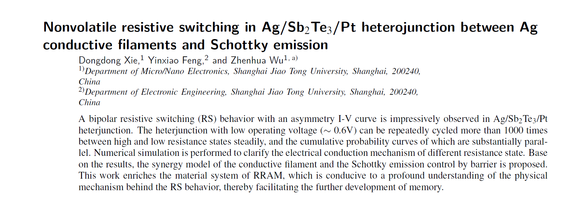
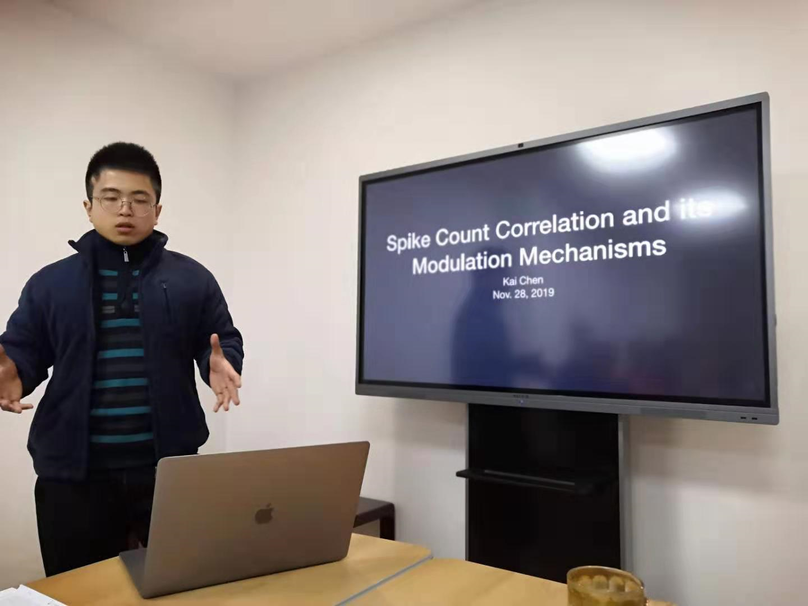

<!-- more -->

# 工作周报

## 2019/11/25

- 上课《**社会科学中的大数据分析**》
- 上课《**复分析**》
- 上课《**Neuronal Dynamics**》
- 改论文

## 2019/11/26

- 上课《**媒体智能**》
- 上课《**人工智能与网络安全**》
- 上课《**微分几何**》
- 改论文

## 2019/11/27

- 改论文
  - 

## 2019/11/28

- 改论文并提交（*Applied* *Physics* Letters）
- CNS组会**spike count correlations analysis in system neuroscience**
  - 

## 2019/11/29

- 做大作业

- 继续学习brain2和quadratic network实现

- 上课《**偏微分方程**》

# 下周计划

- 做大作业

- 推进quadratic network项目