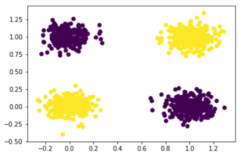
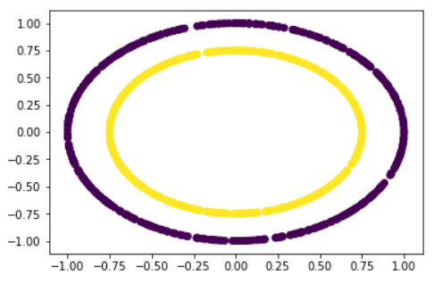
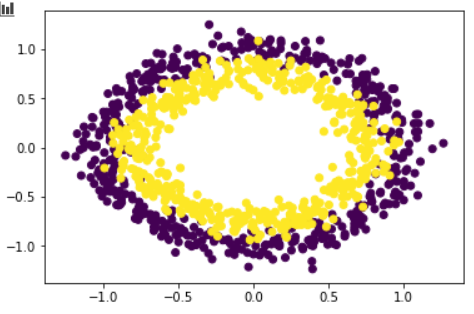

<!-- more -->

# 工作周报

## Quadratic 实验结果

### XOR

| Model       | Linear(2-2) | Linear(2-1-2) | Linear(2-2-2) | Linear(2-3-2) | Quadratic(2-2) |
| ----------- | ----------- | ------------- | ------------- | ------------- | -------------- |
| Parameters  | 6           | 7             | 12            | 17            | 18             |
| Accuracy(%) | 54.5        | 73            | 75.5          | 100           | 100            |

### Cycle

| Model       | Linear(2-2) | Linear(2-3-2) | Linear(2-4-2) | Linear(2-5-2) | Quadratic(2-2) |
| ----------- | ----------- | ------------- | ------------- | ------------- | -------------- |
| Parameters  | 6           | 17            | 22            | 27            | 18             |
| Accuracy(%) | 43.5        | 72.5          | 91.5          | 100           | 100            |

| Model       | Linear(2-2) | Linear(2-3-2) | Linear(2-4-2) | Linear(2-5-2) | Quadratic(2-2) |
| ----------- | ----------- | ------------- | ------------- | ------------- | -------------- |
| Parameters  | 6           | 17            | 22            | 27            | 18             |
| Accuracy(%) | 47.5        | 82            | 84.5          | 91.5          | 95             |

## 2019/12/9

- 上课《**社会科学中的大数据分析**》
- 上课《**复分析**》
- 上课《**Neuronal Dynamics**》
- Quadratic network 与 linear neuron network的比较实验

## 2019/12/10

- 上课《**媒体智能**》
- 上课《**人工智能与网络安全**》
- 上课《**微分几何**》
- 用quadratic network 进行逻辑分类

## 2019/12/11

- 大作业

## 2019/12/12

- 在⚪问题上，用更少的的参数达到了更好的效果
- CNS组会 

## 2019/12/13

- 写作业

- 上课《**偏微分方程**》

# 下周计划

- 做大作业
- 写开题报告
- **2019 Computational Neuroscience Winter School**
  - https://ins.sjtu.edu.cn/schools/2019/12/16/2019-computational-neuroscience-winter-school/1671
- 复习，准备期末考试

# 过去两周完成的代码

用pytroch实现了二次操作，并通过手动和自动两种方式生成梯度并回传

重写pytorch的线性层，改成二次层

重写了pytorch的Conv2d层，改为二次卷积操作

用全连接二次网络实现了mnist的分类

使用了自定义的几组数据（XOR，圆）比较了线性神经元和二次神经元的效果