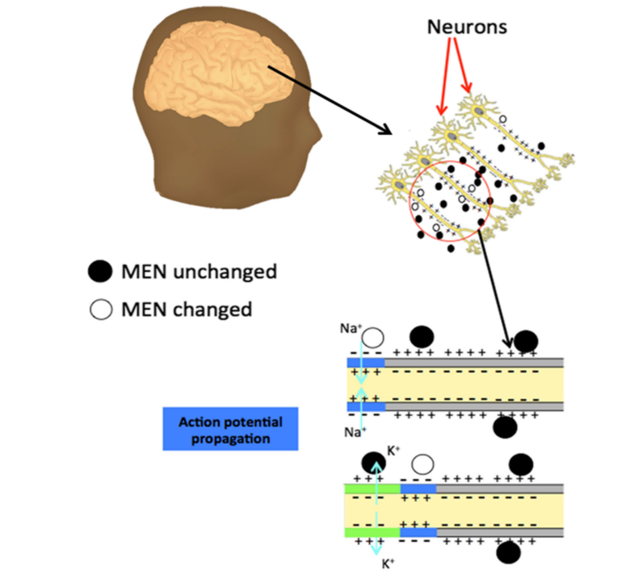

**美国国防部高级研究计划局（DARPA）的下一代非手术神经技术（N3）计划，**已经向6个团队提供了资金，全力打造无需外科手术的脑机接口，可与植入电极脑机接口的性能相匹配。

2018年3月提出有关应用需求之后，审查小组将范围缩小到工业和学术界的6个团队。

### Battelle Team

#### 关键人物: 

- Gaurav Sharma（北卡罗莱纳州立大学）
- Sakhrat Khizroev（加州大学伯克利分校）

#### 方案

MagnetoElectric Nanoparticles+ Magnetic Particle Imaging(MPI)

当动作电位发生时，电荷在膜间的运动会导致磁电粒子的磁矩发生翻转

MPI是一一种直接探测磁性粒子并成像的技术

这两种技术结合就可以实现大脑电场成像

### CMU Team

#### 关键人物：Pulkit Grover

#### 方案

利用超声波引导光进出大脑来检测神经活动。（具体实现方法不明）

### JHU Team

#### 关键人物：David Blodgett

#### 方案

Optical Method：测量光程变化

**光学相干断层扫描**（英文: **Optical coherence tomography**，简称**OCT**）

**空间分辨率   <  $10\mu m$**

深度 < 2mm

### PARC Team

#### 关键人物: Krishnan Thyagarajan

将超声波与磁场配以产生局部电流进行神经调节。（具体实现方法不明）

 ### Rice University Team

#### 关键人物：Jacob Robinson

#### 方案

动作电位会引起神经元荧光的变化，或者可以改变光波的传播。

通过测量神经组织中的光散射，并使用近红外光散射成像技术，以此来检测神经元活动

**深度 < $100\mu m$**

**空间分辨率 < 0.1mm**

### Teledyne Team

#### 关键人物：Patrick Connolly

#### 方案

光泵磁力计：塞曼效应是指原子在外磁场中发光谱线发生分裂且偏振的现象，塞曼效应的强度取决于环境磁场相对于施加的光和射频功率的方向。由此可以检测脑神经元信号

**空间分辨率 > 1mm**