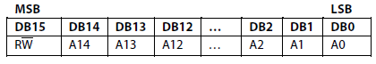
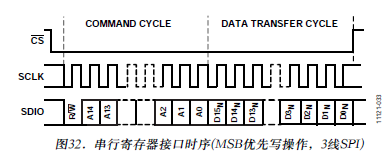
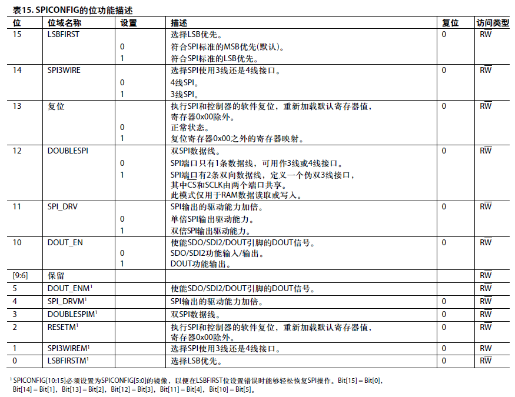
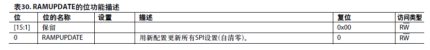

<!-- more -->`

 

### SPI端口

当CS变为有效时，SPI地址和数据传输即开始。SPI主器件通过SDIO提供的第一位是读写指示位(高电平表示读操作，低电平表示写操作)。后续15位就是初始寄存器地址，允许写入或读取一组连续地址。

### 寄存器配置

#### SPI控制寄存器（0x00）

**在本次实验中，应配置为0100010000100010**

### 电源状态寄存器(POWERCONFIG，地址0x01)

**在本次实验中，应配置为0x00**

### 时钟控制寄存器(CLOCKCONFIG，地址0x02)

**在本次实验中，应配置为0x00**

### 基准电阻寄存器(REFADJ，地址0x03)

**在本次实验中，应配置为0x00**

### DAC模拟增益寄存器(DAC4AGAIN，地址0x04-0x07)

**在本次实验中，应配置为0000000001111111（不确定）**

### DAC模拟增益范围寄存器(DACxRANGE，地址0x08)

**在本次实验中，应配置为0x0F（不确定）**

### FSADJ寄存器(DAC4RSET，地址0x09~0x0C)

**在本次实验中，应配置为0x0F**

### 校准寄存器(CALCONFIG，地址0x0D)， 补偿失调寄存器(COMPOFFSET，地址0x0E)

**在本次实验中，应配置为0x0000**

### 更新模式寄存器(RAMUPDATE，地址0x1D)

**全部配置完后更新为0x0001**

### 命令/状态寄存器(PAT_STATUS，地址0x1E)

**0x0001**

### 命令/状态寄存器(PAT_TYPE，地址0x1F)

**0000**

$f_{out}=F_{CLKP/CLKN}*DDS\_TW/2^{24}$

$F_{CLKP/CLKN}=16MHz$

DDS_TW = 0x100000

### Wave3/Wave4/Wave3/Wave4选择寄存器(WAV_CONFIG，地址0x26，0x27)

**3131**

### DAC数字增益寄存器(DAC_DGAIN，地址0x32~0x35)

**0x0400**

$f_{out}=F_{CLKP/CLKN}*DDS\_TW/2^{24}$

$F_{CLKP/CLKN}=16MHz$

DDS_TW = 0x100000

### DDS调谐字MSB寄存器(DDS_TW32，地址0x3E)

**在本次实验中，应配置为0x1000**

### DDS调谐字LSB寄存器(DDS_TW1，地址0x3F)

**在本次实验中，应配置为0x0000**

### DDS相位偏移寄存器(DDS_PW，地址0x40-0x43)

**在本次实验中，应配置为0x02, 0x04, 0x06, 0x08（不确定）**

### DDS周期数4寄存器(DDS_CYC4，地址0x53，0x57，0x5B，0x5F)

在本次实验中，应配置为0x000A

