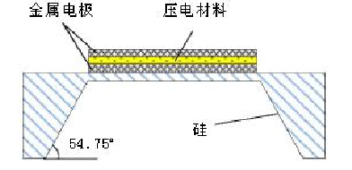

<!--more-->

## 基本知识

超声波透射系数：

$$T=\frac{2Z_l}{Z_p+Z_l}=\frac{2\rho_l c_l}{\rho_p c_p+\rho_l c_l}$$

以水和压电材料界面为例，$T\approx 0.1$

为了减少这些不必要的反射，超声波换能器通常配置有匹配的层，其厚度是介质中波长的四分之一：匹配层(Zm)的声阻抗为: $Z_m=(Z_p Z_l)^{\frac{1}{2}}$

超声在前表面用于超声成像，但为了产生高质量的图像，必须去除后表面产生的超声。通过使用衬垫材料，可以通过超声换能器的阻尼来减少ring-down vibrations，从而产生宽带宽。超声成像系统通常推荐阻抗为2-10 MRayl的衬底

## 压电材料

### AlN

- AlN不需要退火过程，因此可以避免产生残余应力
- 由于其低介电常数、低切向损耗和cmos兼容的制造工艺，AlN是一种很好的移动超声换能器候选材料。

### ZnO

### PZT

### 参考文献：

Hongsoo Choi *Review of piezoelectric micromachined ultrasonic transducers and their applications*

## 微机械超声换能器（Micromachined Ultrasonic Transducer，MUT）

### PMUT（压电超声换能器）

常见的 PMUT 膜片形状有圆形、正方形、长方形、贝壳形、圆柱形和圆顶形等；压电膜材料有 PZT、Zn O、Al N、PMNPT 和 PVDF 等，较常用的是 PZT 与 ZnO 材料，振动膜材料常采用硅、二氧化硅、氮化硅和多晶硅等；

### CMUT（电容超声换能器）

CMUT是一种基于静电能量转换机理的超声换能器，其基本结构一般包括金属上电极、振动膜、边缘支撑、真空腔、绝缘层、下电极和基座等组成部分，类似于平行板电容器。

#### 优势

- 具有较低的声阻抗，不需要复杂的阻抗匹配层，易于空气、水、人体组织等介质的阻抗匹配
- 具有更宽的带宽
- 阵列设计灵活，并具有良好的一致性、可重复性和较高的精密性
- 易于前端电路集成，可以减小体积，实现微型化
- 具有良好的耐高温性能
- 易于批量生产，可以降低成本。

## 两者比较

- CMUT 有更高的带宽：
  - CMUT：>100%
  - PMUT：>50%
- CMUT 有更高的机电耦合系数
  - CMUT：>70%
  - PZT：约20%
  - PMUT：1~6%
- PMUT消耗功率更小，CMUT需要大电压直流偏置
- PMUT膜的偏转不受上下电极分离的限制

### 参考文献：

Hongsoo Choi *Review of piezoelectric micromachined ultrasonic transducers and their applications*