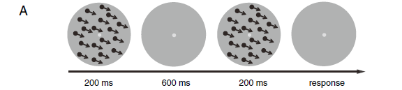

<!-- more -->

## 实验目的

- 在视觉运动感知学习中，神经修改是在高级脑区还是低级脑区
- 怎样的神经修饰是长期的

## 实验内容

### 受试者

- 17人
- 20-25岁
- 右撇子
- 对实验目的一无所知

### 实验步骤

- 两张点图相隔600ms，第二张图相对第一张图旋转过一个小角度$\Delta\theta$
- 每次给人连续的两张运动点图，让人做判断，第二张图相对第一张图是向左旋转还是向右旋转
- 八天的训练分别沿八个不同的方向，使用QUEST staircase策略调整$\Delta\theta$，使得正确率大概维持在75%
- 测试方向与训练方向偏离0，30，60，90度，

### 兴趣域

ROIs被确定为对移动的点块比静止的点块反应更强烈皮质区域。MT+被定义为一组显著响应的体素，位于或接近枕下沟延续的枕部。IPS被定义为位于内侧背顶叶沟内的一组反应显著的体素，也称为IPS2

### 获取MRI数据

在功能运行前收集高分辨率的三维结构数据集。受试者共接受了7次MRI检查，其中1次用于视网膜定位，2次用于Pre、Post1、Post2。

### fMRI数据处理

- 3D运动矫正
- 消除线性趋势
- 高通滤波
- 对于每个受试者和ROI，我们使用一个通用线性模型(GLM)在定位器运行中选择80个最灵敏的体素(横跨两个半球)。

### 单变量分析

### DCM

#### DCM数据分析软件：SPM

#### $$\frac{d\boldsymbol{x}}{dt}=F(\boldsymbol{x},\mu,\theta)=(\boldsymbol{A}+\sum_{j=1}^m\mu_j\boldsymbol{B}^{j})\boldsymbol{x}+C\mu$$

## 实验结果

