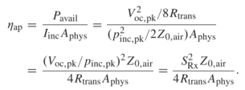

<!-- more -->

## 摘要

总的来说，这篇文章介绍了一种在空气中用超声波向毫米尺寸大小的IOT设备供能的方案。使用超声波的频率为$50kHz$，目标是为一个毫米尺寸的器件提供$0.8V$的电压，$50\mu W$的能量，最终实现了$5\mu W$的供能，并且不需要偏置电压

## APERTURE EFFICIENCY（孔径效率）

可用电能与入射声强之比称为换能器的有效孔径，孔径效率定义为

这个计算值是小信号范围内的值，在较高的电压下，器件的孔径效率降低，这与较高的压力和动态膜位移相对应。

由此引出**动态范围**的概念，定性定义为孔径效率与其小信号值相等的电压范围。

## 测试方案

### 参数测试

- 首先使用商业超声波探头发射超声波；
- 然后用麦克风（水听器）测出某一个位置的声场；
- 再在该位置放置CMUT器件测出两端的开路电压，由此即可得到接受模式的灵敏度sensitivity (in V/Pa)
- 接下来用阻抗分析仪测量CMUT的阻抗

### 功率测试

一阶Dickson乘法器

## 一些想法

### 关于工作频率

为什么使用$50kHz$的工作频率？首先这篇文章的使用场景有点像wifi，需要较大的波长以实现更大范围的能量覆盖；其次，这篇文章使用的Pre-charged CMUT的谐振频率约为$50 kHz$。再次，这篇文章使用的节点尺寸为$10.2mm^2$，超声波在空气中的波长为：$\frac{340m/s}{50kHz}=6.8mm$，可以满足理论需求。

对于Neural Dust，如果要做到亚毫米尺寸，波长必须降低，再加之超声波在组织中波速更快，频率得进一步提高，初步估算需要$>1MHz$的频率，现在的问题就是如何制作出中心频率$>1MHz$，尺寸$<1mm^2$的Pre-charged CMUT器件。