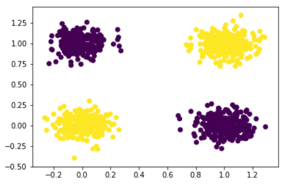
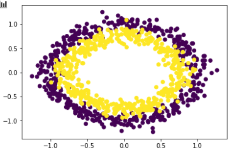

---

title: quadratic_log
mathjax: true
date: 2019-12-10 14:21:52
tags:
categories:
description:
password:
notshow:
---

<!-- more -->

# Quadratic  VS  Linear

## Quadratic Neuron

```
def forward(self, input):
	y1 = F.linear(input, self.wr, self.br)
	y2 = F.linear(input, self.wg, self.bg)
	y3 = F.linear(input**2, self.wb, self.b)
	return y1*y2+y3
```

## Neuron Test
```python
input_size = 2
num_classes = 2
num_epochs = 100
batch_size = 40
learning_rate = 0.01

criterion = nn.CrossEntropyLoss()
optimizer = torch.optim.Adam(model.parameters(), lr=learning_rate)
```

### XOR


| Model       | Linear(2-2) | Linear(2-1-2) | Linear(2-2-2) | Linear(2-3-2) | Quadratic(2-2) |
| ----------- | ----------- | ------------- | ------------- | ------------- | -------------- |
| Parameters  | 6           | 7             | 12            | 17            | 18             |
| Accuracy(%) | 54.5        | 73            | 75.5          | 100           | 100            |

### Cycle


| Model       | Linear(2-2) | Linear(2-3-2) | Linear(2-4-2) | Linear(2-5-2) | Quadratic(2-2) |
| ----------- | ----------- | ------------- | ------------- | ------------- | -------------- |
| Parameters  | 6           | 17            | 22            | 27            | 18             |
| Accuracy(%) | 43.5        | 72.5          | 91.5          | 100           | 100            |



| Model       | Linear(2-2) | Linear(2-3-2) | Linear(2-4-2) | Linear(2-5-2) | Quadratic(2-2) |
| ----------- | ----------- | ------------- | ------------- | ------------- | -------------- |
| Parameters  | 6           | 17            | 22            | 27            | 18             |
| Accuracy(%) | 47.5        | 82            | 84.5          | 91.5          | 95             |

## AlexNet

79.06

