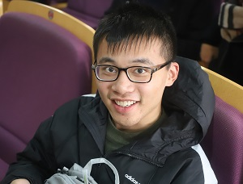

## Education

#### 06/2019-Present

- Institute for Interdisciplinary Information Sciences, Tsinghua University
- *Pursuing PHD in computer science and technology*

#### 09/2016–Present

- School of Electronic Information and Electrical Engineering, Shanghai Jiaotong University
- *Pursuing B.S. in Information Engineering(AI)*
- Overall GPA: 90.0/100

#### 09/2016-Present

- Zhiyuan College, Shanghai Jiaotong University
- Zhiyuan Honors Program of Engineering
- Top5% students of all engineering students at SJTU

#### 03/2018–Present

- School of Mathematical Sciences, Shanghai Jiaotong University

- Pursuing a second degree in Mathematics & Applied Mathematics